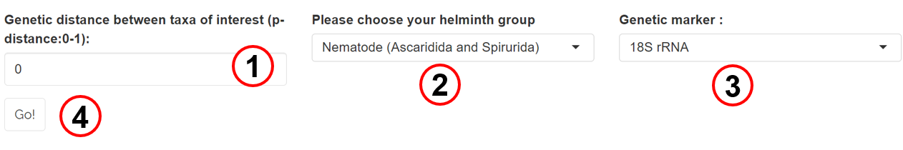

####  Input data: 
The ABIapp requires the following information: genetic distance value, helminth group of interest, and genetic marker used.

1. Input genetic distance value (0 to 1)

2. Select helminth group of interest

3. Select genetic marker used to obtain genetic distance

4. Select ‘Go!’ to run the application
