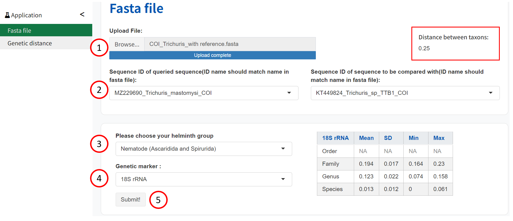

#### การใช้ ABIapp
ABIapp ต้องการข้อมูลต่อไปนี้: 
ค่าระยะทางทางพันธุกรรม กลุ่มความสนใจของหนอนพยาธิ และเครื่องหมายทางพันธุกรรมที่ใช้

#### ใช้วิธีใส่ไฟล์ .fasta:

 
1.	ใส่ไฟล์ fasta ที่ได้ทำการวิเคราะห์ลำดับ

2.	เลือกรหัสลำดับของอนุกรมวิธานที่สอบถาม และ อนุกรมวิธานที่นำมาเปรียบเทียบ

3.	เลือกกลุ่มที่สนใจของหนอนพยาธิ

4.	เลือกเครื่องหมายพันธุกรรมที่ใช้เพื่อให้ได้ระยะทางพันธุกรรม:
18S rRNA, 28S rRNA, ITS1, ITS2, COI, COII, cytB, ND1, 12S rRNA, 16S rRNA

5.	เลือก ‘Submit!’ เพื่อเรียกใช้แอปพลิเคชัน

#### ใช้วิธีป้อนค่าระยะห่างทางพันธุกรรม:

1. ป้อนค่าระยะทางทางพันธุกรรม (0 ถึง 1)

2. เลือกกลุ่มที่สนใจของหนอนพยาธิ:

3. เลือกเครื่องหมายพันธุกรรมที่ใช้เพื่อให้ได้ระยะทางพันธุกรรม:
18S rRNA, 28S rRNA, ITS1, ITS2, COI, COII, cytB, ND1, 12S rRNA, 16S rRNA

4. เลือก '‘Submit!' เพื่อเรียกใช้แอปพลิเคชัน
