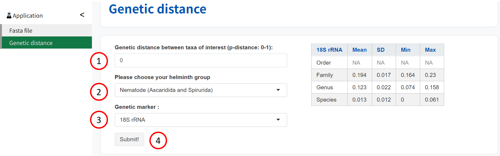

#### การใช้ ABIapp
ABIapp ต้องการข้อมูลต่อไปนี้: 
ค่าระยะทางทางพันธุกรรม กลุ่มความสนใจของหนอนพยาธิ และเครื่องหมายทางพันธุกรรมที่ใช้

1. ป้อนค่าระยะทางทางพันธุกรรม (0 ถึง 1)
2. เลือกกลุ่มที่สนใจของหนอนพยาธิ:
3. เลือกเครื่องหมายพันธุกรรมที่ใช้เพื่อให้ได้ระยะทางพันธุกรรม:
18S rRNA, 28S rRNA, ITS1, ITS2, COI, COII, cytB, ND1, 12S rRNA, 16S rRNA
4. เลือก 'ไป!' เพื่อเรียกใช้แอปพลิเคชัน
