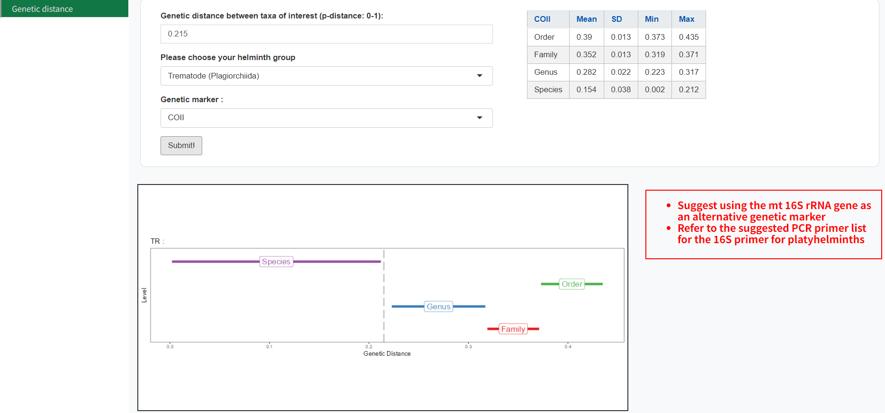
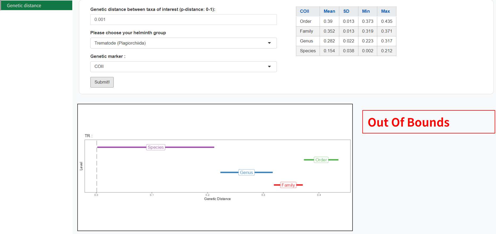

####  Output visualization: 

#### Example 1 (0.15 genetic distance, Trematode (Plagiorchiida), COII gene) 

The queried genetic distance value is indicated by a grey dashed line against the range of genetic distances for each taxonomic hierarchy level.

Interpretation of output
The genetic distance of 0.15 falls within the interspecies level, indicating that the two trematode taxa are different species. The table also shows that the mean genetic distance at the species level is 0.154, and the genetic distance ranges from 0.002 to 0.212.

#### Example 2 (0.215 genetic distance, Trematode (Plagiorchiida), COII gene) 

The genetic distance of 0.215 falls between species and genus level. Based on the ABIapp, the COII gene result is inconclusive for the queried genetic distance. Another genetic marker is recommended for molecular analysis in this scenario to better interpret results.

#### Example 3 (0.001 genetic distance, Trematode (Plagiorchiida), COII gene) 

The genetic distance of 0.001 falls below the minimum distance at interspecies level, indicating the possibility of cryptic species, subspecies, or population level.
