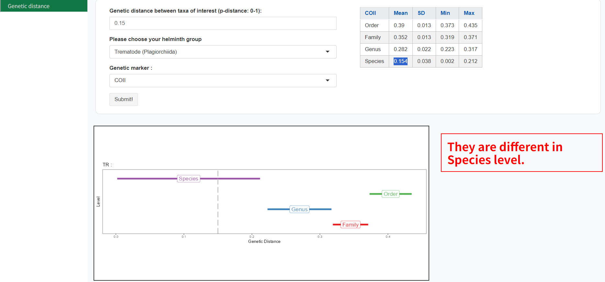

#### การตีความผลลัพธ์:

ABIapp แสดงผลผ่าน: การแสดงภาพกราฟิก โดยที่ค่าระยะทางทางพันธุกรรมที่สอบถามจะถูกระบุด้วยเส้นประสีเทาเทียบกับช่วงของระยะทางทางพันธุกรรมสำหรับระดับลำดับชั้นการจัดหมวดหมู่แต่ละระดับ

•	การตีความผลลัพธ์ที่ได้รับในกล่องข้อความ ซึ่งตัวอย่างได้แก่:
1. ‘They are different species/genera/family/order’ ระบุสองชนิด/สกุล/วงศ์/ลำดับที่ต่างกัน เนื่องจากระยะห่างทางพันธุกรรมที่สอบถามอยู่ในค่าต่ำสุดและสูงสุดในระดับอนุกรมวิธานตามลำดับ
2. Out of bounds’ – บ่งชี้ความเป็นไปได้ของสปีชีส์ที่คลุมเครือ สปีชีส์ย่อย หรือระดับประชากร เนื่องจากระยะห่างทางพันธุกรรมที่สืบค้นต่ำกว่าค่าต่ำสุดที่ระดับสปีชีส์
3. ‘Suggest to use another genetic marker’ – ระบุว่าเครื่องหมายทางพันธุกรรมอื่นอาจเหมาะสมกว่าสำหรับการกำหนดขอบเขตของสายพันธุ์ของอนุกรมวิธานที่สนใจที่เลือก เนื่องจากระยะห่างทางพันธุกรรมที่สอบถามอยู่ระหว่างสองระดับการจัดอนุกรมวิธาน

•	ตารางแสดงค่าเฉลี่ย ค่าต่ำสุด ค่าสูงสุด และค่าเบี่ยงเบนมาตรฐานของระยะห่างทางพันธุกรรมโดยประมาณโดยใช้ค่า K-mean พร้อมเครื่องหมายทางพันธุกรรมที่ระบุและกลุ่มที่สนใจของหนอนพยาธิ

##### Example 1 (0.15 genetic distance, trematode, COI gene) 

จากตัวอย่างข้างต้น ระยะห่างทางพันธุกรรมที่สอบถามสำหรับพยาธิใบไม้ 2 แท็กซ่า โดยใช้ยีน COI คือ 0.15 โดยตาม ABIapp ระยะทางทางพันธุกรรมที่ 0.15 อยู่ในระดับ interspecies 
ซึ่งบ่งชี้ว่าพยาธิใบไม้ทั้งสองเป็นสปีชีส์ที่แตกต่างกัน ตารางยังแสดงให้เห็นว่าระยะห่างทางพันธุกรรมเฉลี่ยที่ระดับสปีชีส์คือที่ 0.146 จากช่วงระยะห่างทางพันธุกรรมระหว่างสปีชีส์อยู่ระหว่าง 0.087 ถึง 0.177

#### Example 2 (0.18 genetic distance, trematode, COI gene) 

ในอีกตัวอย่างหนึ่ง หากระยะห่างทางพันธุกรรมที่สอบถามสำหรับพยาธิใบไม้สองแท็กซ่า โดยใช้ยีน COI คือ 0.18 ระยะห่างทางพันธุกรรมจะอยู่ระหว่างสปีชีส์และระดับสกุล (Genus) ผลที่ได้จาก ABIapp โดยใช้ยีน COI จะไม่สามารถระบุระดับอนุกรมวิธานของตัวอย่างที่ศึกษาได้ แนะนำให้ใช้เครื่องหมายทางพันธุกรรมชนิดอื่นเพื่อการวิเคราะห์ตีความผลลัพธ์ที่ดีขึ้น โดย ABIapp จะแนะนำเครื่องหมายทางพันธุกรรมที่มีศักยภาพให้แก่ผู้ใช้ในกล่องสีแดง  ในกรณีนี้ แนะนำให้ใช้ยีน mitochondrial 16S rRNA เป็นตัวบ่งชี้ทางพันธุกรรมอีกตัวหนึ่งเพื่อตีความผลลัพธ์ได้ดีขึ้น แม้ว่ายีน rRNA ของไมโตคอนเดรีย (12S และ 16S) ยังไม่ได้รับความนิยมในการจัดจำแนกปรสิตหนอนพยาธิ อย่างไรก็ดี ได้มีการพิสูจน์ความเหมาะสมในการจำแนกสปีชีส์ที่มีความหลากหลายรวมทั้งสปีชีส์คลุมเครือได้อย่างดี (Chan et al. 2020, 2021, 2022) 
