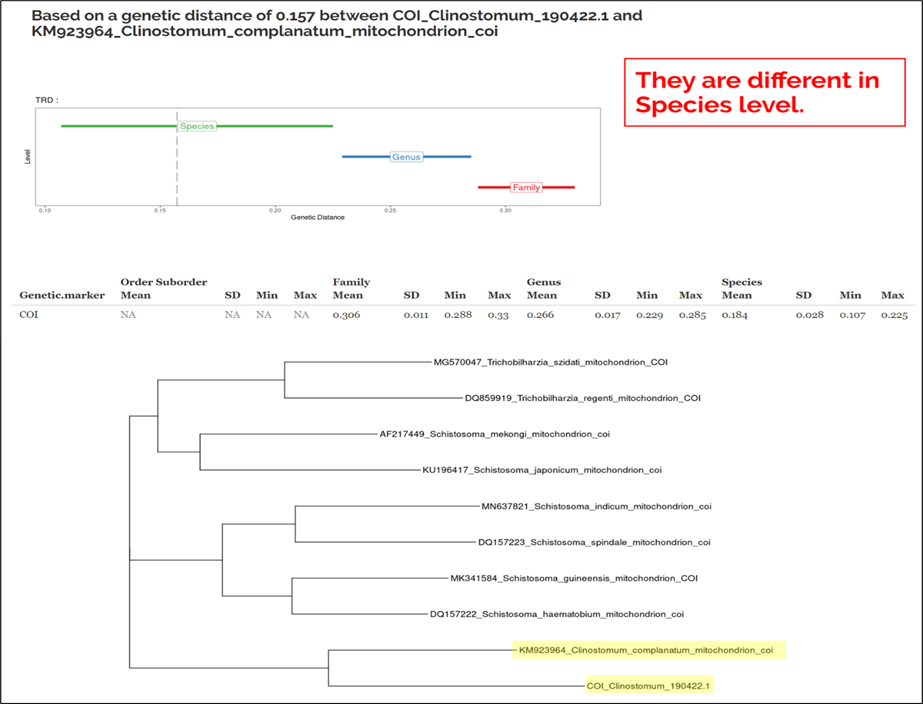

####  Output visualization: 

##### Example 1 (FASTA file , Trematode Diplostomida, COI gene) 

If a FASTA file was the input, a genetic distance value will be calculated for the queried taxon against the reference taxon selected. The genetic distance calculated is indicated by the grey dashed line. The results indicate that based on a genetic distance of 0.157 between the two taxa, the genetic distance falls within the interspecies range, implying that they are different species. A simple phylogenetic tree using p-distances is shown at the bottom to visualize all the taxa in the aligned FASTA file.

