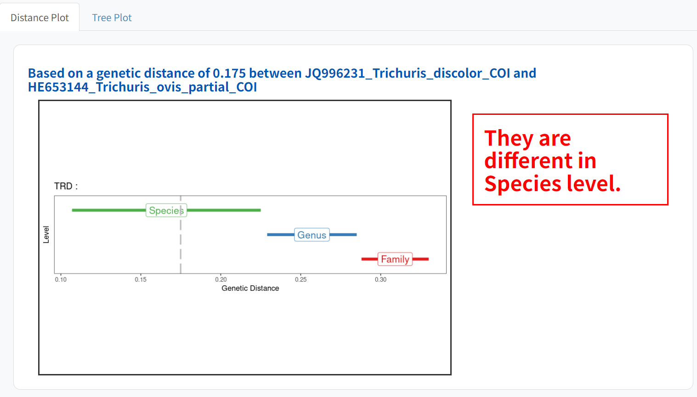

#### การตีความผลลัพธ์:

ABIapp แสดงผลผ่าน: การแสดงภาพกราฟิก โดยที่ค่าระยะห่างทางพันธุกรรมที่สอบถามจะถูกระบุด้วยเส้นประสีเทาเทียบกับช่วงของระยะห่างทางพันธุกรรมสำหรับระดับลำดับชั้นการจัดหมวดหมู่แต่ละระดับ

•	การตีความผลลัพธ์ที่ได้รับในกล่องข้อความ ซึ่งตัวอย่างได้แก่:
1. ‘They are different species/genera/family/order’ ระบุสองชนิด/สกุล/วงศ์/ลำดับที่ต่างกัน เนื่องจากระยะห่างทางพันธุกรรมที่สอบถามอยู่ในค่าต่ำสุดและสูงสุดในระดับอนุกรมวิธานตามลำดับ
2. Out of bounds’ – บ่งชี้ความเป็นไปได้ของสปีชีส์ที่คลุมเครือ สปีชีส์ย่อย หรือระดับประชากร เนื่องจากระยะห่างทางพันธุกรรมที่สืบค้นต่ำกว่าค่าต่ำสุดที่ระดับสปีชีส์
3. ‘Suggest to use another genetic marker’ – ระบุว่าเครื่องหมายทางพันธุกรรมอื่นอาจเหมาะสมกว่าสำหรับการกำหนดขอบเขตของสายพันธุ์ของอนุกรมวิธานที่สนใจที่เลือก เนื่องจากระยะห่างทางพันธุกรรมที่สอบถามอยู่ระหว่างสองระดับการจัดอนุกรมวิธาน

•	ตารางแสดงค่าเฉลี่ย ค่าต่ำสุด ค่าสูงสุด และค่าเบี่ยงเบนมาตรฐานของระยะห่างทางพันธุกรรมโดยประมาณโดยใช้ค่า K-mean พร้อมเครื่องหมายทางพันธุกรรมที่ระบุและกลุ่มที่สนใจของหนอนพยาธิ

##### Example 1 (FASTA file , Trematode Diplostomida, COI gene) 

ถ้าวิธีใส่ไฟล์ Fasta ค่าระยะห่างทางพันธุกรรมจะถูกคำนวณจาก แท็กซ่าทั้งคู่ที่ถูกเลือก โดยค่าระยะห่างทางพันธุกรรมจะถูกแสดงเป็นเส้นปะสีเทา
จากตัวอย่างระบุว่าตามระยะทางพันธุกรรมระหว่างแท็กซ่าทั้งสอง คือ  0.157 ระยะทางพันธุกรรมจะอยู่ในช่วงระหว่างสปีชีส์ ซึ่งหมายความว่าพวกมันเป็นสปีชีส์ที่แตกต่างกัน
และ ยังมีการแสดงผลเป็นกราฟต้นไม้โดยใช้ระยะห่างจะถูกแสดงที่ด้านล่างเพื่อให้เห็นภาพแท็กซ่าทั้งหมดในไฟล์ FASTA

