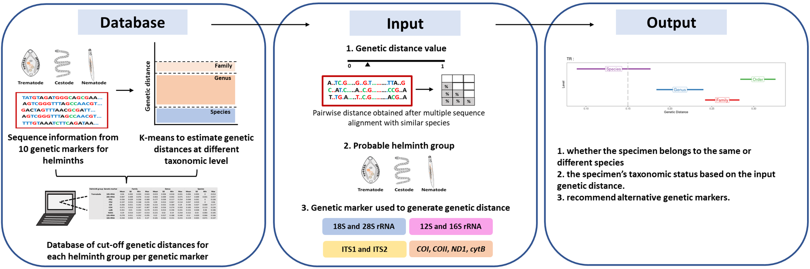

ABI uses the data obtained from Chan et al. (2021), where estimated cut-off genetic distance values for nematodes, trematodes, and cestodes were generated for ten genetic markers using the K-means clustering algorithm (5). The ten genetic markers are: nuclear 18S rRNA gene, nuclear 28S rRNA gene, nuclear ITS1 region, nuclear ITS2 region, mitochondrial 12S rRNA gene, mitochondrial 16S rRNA gene, and mitochondrial protein-coding genes COI, COII, NAD1, cytB. Briefly, cut-off genetic distances for each group of helminths per genetic marker were estimated using the K-means algorithm implemented in Wolfram Mathematica 12.1 (6). The minimum and maximum genetic distances were obtained for each taxonomic hierarchy level as a basis for taxonomic boundaries. 

ABI allows users to input their genetic distances obtained from their taxa of interest from the three groups of helminths. The queried value will be compared against the database of estimated cut-off genetic distance, and the user will be able to know where their queried value is positioned and which taxonomic hierarchy level it falls into.
